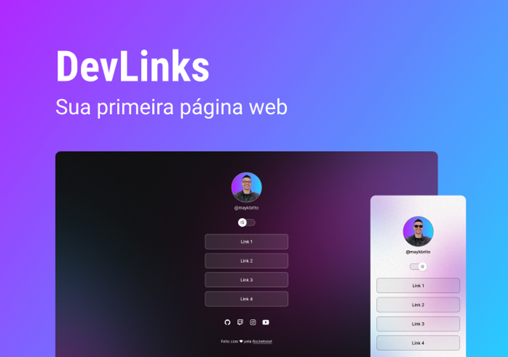

<h1 align="center"> DevLinks</h1>

Programa exlusivo e gratuito, promovido pela Rocketseat para ensino de tecnologia para web.

  <a href="#-tecnologias">Tecnologias</a>     |    
  <a href="#-projeto">Projeto</a>     |    
  <a href="#-layout">Layout</a>     |    
  <a href="#memo-licença">Licença</a>

  

 

  

## 🚀 Tecnologias

Esse projeto foi desenvolvido com as seguintes tecnologias:

- HTML e CSS
- Git e Github
- JavaScript
- Figma

## 💻 Projeto

O DevLinks é um projeto agregador de links para usar como cartão de visitas online.

## 🔖Layout

Você pode visualizar o layout do projeto através de [ DESSE LINK ](<https://www.figma.com/file/N7A5LXBjkxISm9Mrx6tsOY/DevLinks-(Community)?node-id=0%3A1&t=Sw7fa8UIjnwlix6H-0>). É necessário ter conta no [ Figma ](https://figma.com) para acessá-lo.

## : memo : Licença

Esse projeto está sob a licença MIT.

---

Feito com ♥ por Anny Mello

# projeto-dev-links

# projeto
